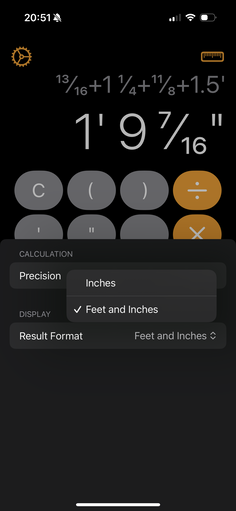
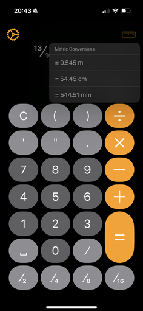
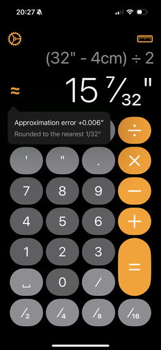

# WoodworkingCalculator

A four-function calculator tailored for the US customary system as it's used in woodworking.

Specifically, it:

- Understands fractions.
  - Type fractions in. Get fractions as output.
  - Configurable fractional precision.
  - Shortcuts for commonly-used fractions.
  - Accepts decimal, but will round the result to the nearest fraction.
- Understands feet-and-inches notation.
  - Use the ' and " keys when necessary.
  - Configurably output feet-and-inches or just inches, to taste.
- Includes basic metric support, for your foreign tools or hardware.
  - Input m/cm/mm values right alongside US customary ones.
  - Show the result of any calculation in m/cm/mm.

### Screenshots

Supports idiomatic entry of fractions (including top-heavy ones), mixed numbers and decimals, all with and without units.

Dedicated buttons for feet ("), inches ('), fractions (/) and common fractions (half, quarter, eighth, sixteenth) make input quick.

Results are always shown in fractional US customary units.

But you can use feet and inches both for larger measures.

Or even show the result in metric.

You can even input metric if you need to mix systems.

And results will be shown in US customary, indicating any rounding errors above 0.001".

## Building

There is a separate Xcode build target for [Citron](https://github.com/roop/citron/) and the grammar file it compiles. This is hardcoded to use `SDKROOT=macosx` so it works when the run target is iPhones.

(If you delete the generated `.swift` file, you will need to run a build twice in a row, since I don't know how to Xcode and can't figure out how to tell it to add the file to the same build that's currently running instead of waiting for it to notice on disk for the next build. Then I wouldn't have to commit it.)

## Testing

Citron is not thread-safe. I don't want to colocate every test in a file that might use Citron, so as it stands, you ~~may~~ will almost certainly get spurious string-index-out-of-bounds failures if you run all tests at once.

Every test suite that uses Citron should be marked as `.serialized` so that at least that file/suite can be run in isolation without stepping on its own feet.
