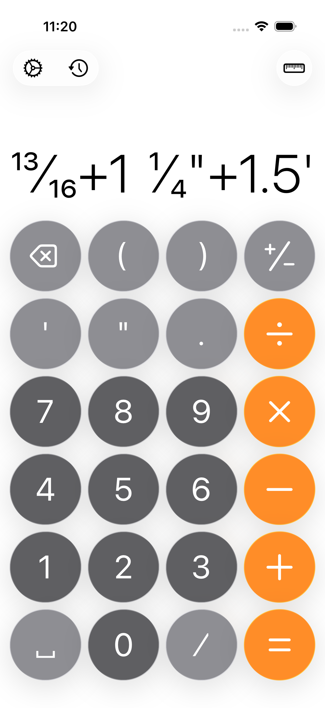
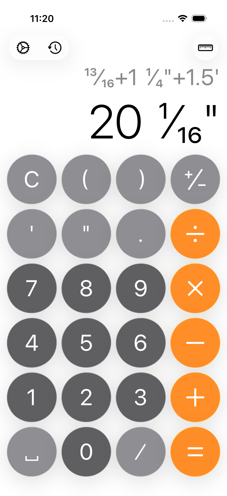
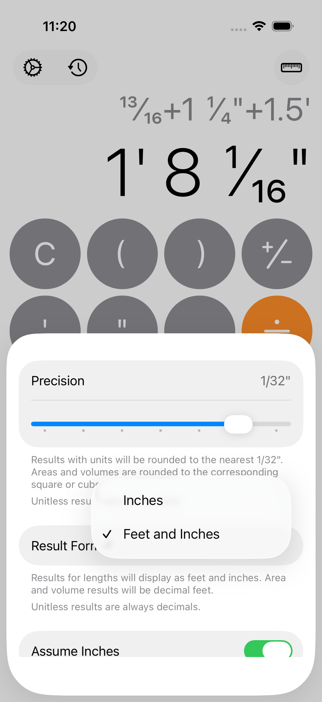
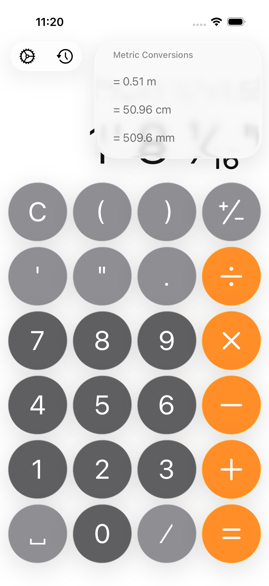
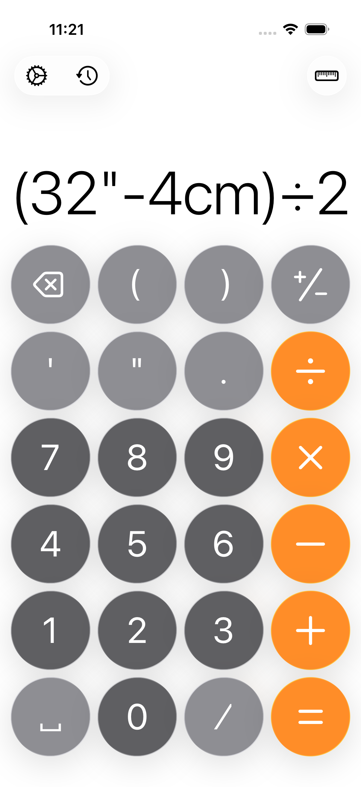
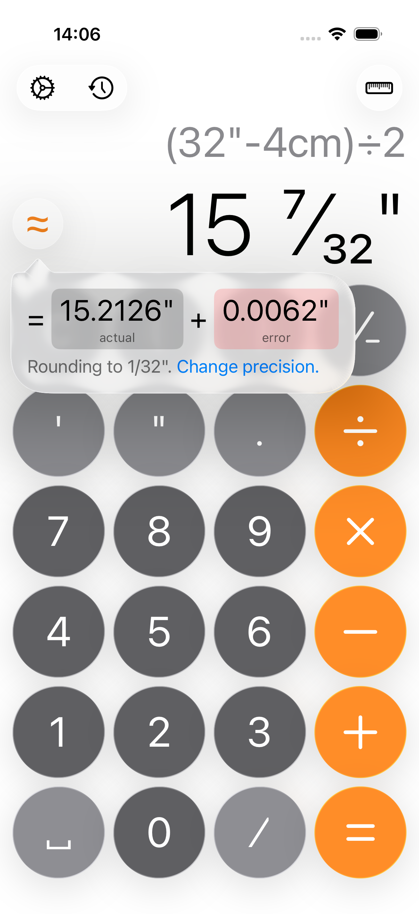
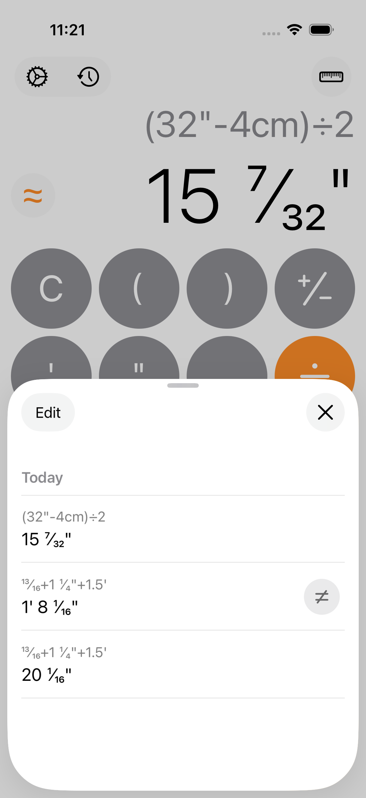
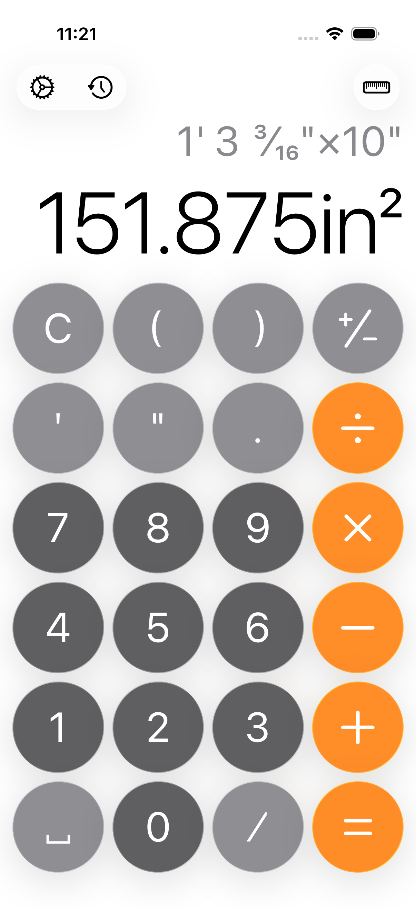
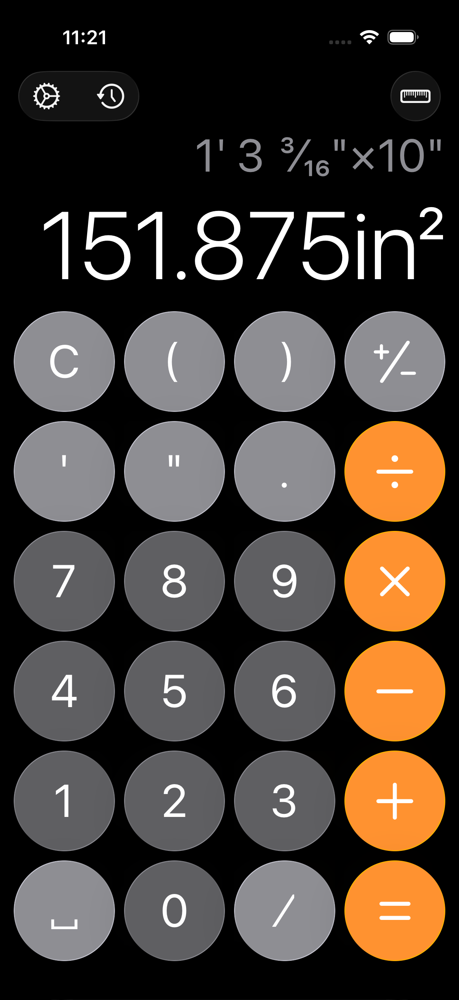

# Woodworking Calculator

A four-function calculator tailored for the US customary system as it's used in woodworking for iOS.

[Get it on the App Store.](https://apps.apple.com/us/app/woodworking-calculator/id6758412492)

Specifically, it:

- Understands fractions.
  - Type fractions in. Get fractions as output.
  - Configurable fractional precision.
  - Accepts decimal, but will round the result to the nearest fraction.
- Understands feet-and-inches notation.
  - Use the ' and " keys when necessary.
  - Configurably output feet-and-inches or just inches, to taste.
- Includes basic metric support, for your foreign tools or hardware.
  - Input m/cm/mm values right alongside US customary ones.
  - Show the result of any calculation in m/cm/mm.

### Screenshots

Supports idiomatic entry of fractions (including top-heavy ones), mixed numbers and decimals, all with and without units.

Dedicated buttons for feet ("), inches ('), fractions (/) make input quick.

Results are always shown in fractional US customary units.

But you can use feet and inches both for larger measures.

And show the result in metric.

You can even input metric if you need to mix systems.

And results will be shown in US customary, indicating any rounding errors to four decimal places.

You can consult the history of calculations you've made.

It understands area and volume measures as well.

And, of course, has a dark mode.

## Building

There is a separate Xcode build target for [Citron](https://github.com/roop/citron/) and the grammar file it compiles. This is hardcoded to use `SDKROOT=macosx` so it works when the run target is iPhones.

(If you delete the generated `.swift` file, you will need to run a build twice in a row, since I don't know how to Xcode and can't figure out how to tell it to add the file to the same build that's currently running instead of waiting for it to notice on disk for the next build. Then I wouldn't have to commit it.)

## Screenshots

Use `images/take-screenshots.sh` to run the UI "test" that generates the App Store listing screenshots and extract them to this repo.

Use `images/compose-listing-images.sh` to composite those screenshots onto the background images for the listing.

The background images are multiple layers in the `images/pixlr-background-source.pxz` file, for use with [Pixlr](https://pixlr.com/editor/).

## Testing

Citron is not thread-safe, so all tests are run in serial between files (per project configuration) and within files (using `@Suite(.serialized)` usually).

Reentrancy errors with Citron manifest as string-index-out-of-bounds exceptions, so if you hit one of those, check Citron first.
